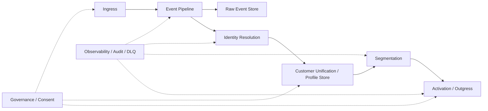

# CDP Documentation Index

This directory describes the high-level design and production implementation plan for a Customer Data Platform (CDP).

The documents are written for two audiences:

1. Human maintainers who need to understand the architecture later.
2. AI coding agents that need stable requirements, boundaries, and implementation order.

## Core CDP flow

## Documents

| File | Purpose |
|---|---|
| `01-architecture-overview.md` | CDP architecture, components, service boundaries, and deployment style. |
| `02-production-requirements.md` | Non-functional requirements for production readiness. |
| `03-event-model-and-ingress.md` | Event envelope, ingestion APIs, validation, idempotency, and pipeline rules. |
| `04-identity-resolution.md` | Identity graph, deterministic matching, cluster merge rules, and safety constraints. |
| `05-customer-profile-unification.md` | Unified profile store, merge policies, computed attributes, and profile update flow. |
| `06-segmentation-engine.md` | Stateless segmentation first, rule DSL, membership tracking, and future stateful segmentation. |
| `07-activation-outgress.md` | Destination model, webhook/Kafka activation, retry, delivery logs, and idempotency. |
| `08-governance-security-observability.md` | Tenant isolation, consent, PII protection, audit, metrics, DLQ, and monitoring. |
| `09-data-model.md` | Initial PostgreSQL schema draft for the CDP core. |
| `10-implementation-roadmap.md` | Recommended build order from foundation to production hardening. |
| `11-ai-agent-instructions.md` | Rules and context for AI agents working inside this repository. |
| `12-testing-and-release-checklist.md` | Testing strategy, CI/CD gates, and production release checklist. |
| `13-operations.md` | Operations runbook: running the full stack, observability, load test, backup/restore, failure tests. |
| `14-usage.md` | How-to usage guide: start the stack, auth, send events, segments, destinations, governance, DLQ — with `curl` examples. |
| `15-future-enhancements.md` | Planned admin-API enhancements (unsubscribe, list destinations by segment, view all identifiers) with implementation specs and interim workarounds. |

## Design principles

- Keep `Identity Resolution` and `Customer Unification` separate.
- Make `tenant_id` mandatory everywhere.
- Keep HTTP ingress fast. Do not perform heavy processing in the request path.
- Use an event bus for asynchronous processing.
- Every event must be traceable from ingestion to activation.
- Start with deterministic identity resolution only.
- Start with stateless segmentation only.
- Build replay, idempotency, retry, and DLQ from the beginning.
- Do not add complex journey orchestration until the core CDP is stable.

## Recommended first MVP

The first production-grade MVP should include:

1. Tenant and source API key management.
2. Event ingestion API.
3. Kafka/Redpanda event pipeline.
4. Raw event store.
5. Deterministic identity resolution.
6. Unified customer profile store.
7. Stateless segmentation.
8. Webhook/Kafka activation.
9. Retry and DLQ.
10. Metrics and audit logs.
