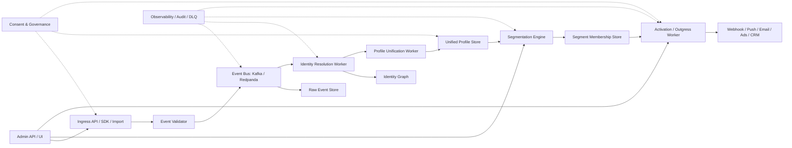

# CDP Architecture Overview

## Goal

Build a production-grade Customer Data Platform that can receive customer events, resolve identities, build unified profiles, evaluate segments, and activate data to downstream systems.

The platform should start simple but be designed so it can grow into real-time segmentation, campaign orchestration, and multi-channel activation later.

## High-level architecture



## Core components

| Component | Responsibility |
|---|---|
| Ingress | Receive events, identify calls, alias calls, batch imports, and webhooks. |
| Event Pipeline | Move events reliably between processing stages. |
| Raw Event Store | Store original events for replay, debugging, audit, and analytics. |
| Identity Resolution | Connect identifiers into identity clusters. |
| Customer Unification | Build the final unified customer profile from resolved identities and events. |
| Segmentation | Evaluate segment rules and maintain segment membership. |
| Activation / Outgress | Send customer data, events, or segment membership changes to destinations. |
| Governance / Consent | Enforce tenant isolation, consent, PII protection, retention, and audit requirements. |
| Observability | Metrics, logs, traces, DLQ management, and operational visibility. |
| Admin | Configure tenants, sources, schemas, segments, destinations, and monitor system state. |

## Recommended initial service boundary

Do not start with one microservice per component. Start with a modular monolith plus workers.

```text
cdp-api
cdp-worker
cdp-admin
cdp-shared
```

### `cdp-api`

Responsibilities:

- Ingress API.
- Admin API.
- Source configuration.
- Destination configuration.
- Segment configuration.
- API key authentication.
- Rate limiting.
- Event publishing.

### `cdp-worker`

Responsibilities:

- Consume events from Kafka/Redpanda.
- Store raw events.
- Resolve identities.
- Update customer profiles.
- Evaluate segment rules.
- Create activation tasks.
- Send activation payloads.
- Retry failures.
- Push unrecoverable failures to DLQ.

### `cdp-admin`

Responsibilities:

- Admin UI.
- Operational dashboards.
- DLQ viewer.
- Event/profile viewer.
- Segment/destination management screens.

This can be separate frontend code or part of the same repository.

### `cdp-shared`

Responsibilities:

- Shared event envelope.
- Tenant context.
- Error types.
- Security helpers.
- Idempotency helpers.
- Audit helpers.
- Common test fixtures.

## Future service split

Split only when needed:

```text
cdp-ingress
cdp-identity
cdp-profile
cdp-segmentation
cdp-activation
cdp-admin
```

Do not split early unless deployment scale, team ownership, or failure isolation requires it.

## Recommended technology stack

Initial stack:

```text
Backend: Go or Java/Quarkus
Database: PostgreSQL
Event bus: Kafka or Redpanda
Cache/state: Redis
Observability: Prometheus + Grafana + Loki
Deployment: Docker Compose first, Kubernetes later
```

Optional later additions:

```text
ClickHouse: event analytics and large-scale event query
MinIO/S3: raw event archive and export
Temporal: journey orchestration and campaign workflows
Flink/Kafka Streams: stateful behavioral segmentation
```

## Production design rules

- `tenant_id` is mandatory in every table, event, log, metric label where applicable, and processing context.
- Event processing must be asynchronous after ingress validation.
- Ingress must not perform identity resolution, profile update, segmentation, or activation synchronously.
- Every processing step must be idempotent.
- Every failure must be observable.
- Every unrecoverable event must be sent to DLQ with reason and context.
- PII must not appear in logs.
- Activation must check consent before sending.
- Identity Resolution must never merge identities across tenants.

## First production-grade MVP scope

Build these first:

1. Tenant/source/API key management.
2. Event ingestion API.
3. Kafka/Redpanda event pipeline.
4. Raw event store.
5. Deterministic identity resolution.
6. Unified profile store.
7. Stateless segmentation.
8. Webhook/Kafka activation.
9. Retry and DLQ.
10. Metrics, structured logs, and audit log.

Defer these:

- Browser SDK.
- Mobile SDK.
- Probabilistic identity matching.
- Complex journey builder.
- Drag-and-drop campaign builder.
- Ads integrations.
- Email editor.
- Advanced attribution.
- ML recommendation.
- Stateful behavioral windows.
