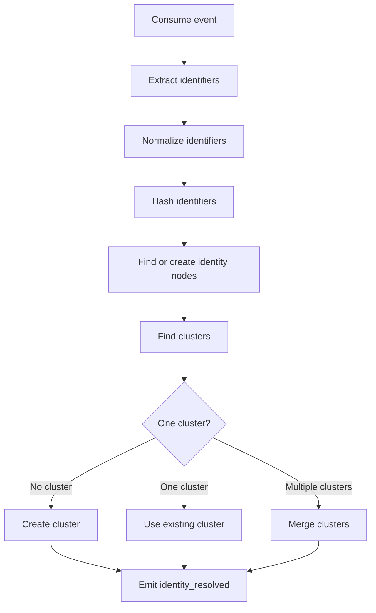

# Identity Resolution

## Purpose

Identity Resolution answers this question:

```text
Which identifiers belong to the same person?
```

It does not build the final customer profile. That is the responsibility of Customer Unification / Profile Store.

## Difference between Identity Resolution and Customer Unification

```text
Identity Resolution = connect IDs
Customer Unification = build final customer profile
```

Example identifiers:

```text
anonymous_id = anon_123
user_id = user_456
email = user@example.com
phone = +8490...
crm_id = C001
device_id = device_789
```

Identity Resolution connects these into one identity cluster.

Customer Unification uses that cluster to build the final customer profile.

## First version strategy

Use deterministic matching only.

Do not start with probabilistic matching.

Allowed deterministic rules:

```text
Same tenant_id + same user_id => same customer
Same tenant_id + same email => same customer
Same tenant_id + same phone => same customer
identify(anonymous_id, user_id) => merge anonymous into known user
alias(previous_id, user_id) => merge two identities
```

Forbidden in version 1:

```text
Same IP address
Same user agent
Same device fingerprint only
Same name
Similar behavior
Fuzzy match
Machine-learning match
```

Reason: false identity merges are dangerous and hard to undo.

## Data model

```sql
identity_node (
  id,
  tenant_id,
  namespace,
  value_hash,
  value_encrypted,
  created_at,
  updated_at
)

identity_cluster (
  id,
  tenant_id,
  canonical_user_id,
  status,
  created_at,
  updated_at
)

identity_cluster_member (
  tenant_id,
  cluster_id,
  identity_node_id,
  confidence,
  source,
  created_at
)

identity_merge_history (
  id,
  tenant_id,
  from_cluster_id,
  to_cluster_id,
  reason,
  event_id,
  created_at
)
```

## Namespaces

Initial namespaces:

```text
user_id
anonymous_id
email
phone
external_id
crm_id
device_id
cookie_id
```

## Identifier normalization

Before hashing or lookup:

### Email

- Trim spaces.
- Lowercase.

### Phone

- Normalize to E.164 if possible.
- Remove spaces and formatting characters.

### User ID / External ID

- Trim spaces.
- Preserve case unless source system defines case-insensitive IDs.

### Anonymous ID / Device ID

- Trim spaces.
- Preserve exact value.

## Hashing and encryption

For lookup:

```text
value_hash = HMAC_SHA256(tenant_secret, normalized_value)
```

For display/debug if needed:

```text
value_encrypted = encrypt(normalized_value)
```

Rules:

- Never log raw identifiers.
- Use tenant-scoped hashing when possible.
- Avoid plain text PII in database unless explicitly required.

## Identity resolution flow



## Cluster merge rules

Merge must be:

- Tenant-scoped.
- Transactional.
- Idempotent.
- Audited.
- Safe under concurrent events.

When merging clusters:

1. Choose a surviving cluster.
2. Move members from losing cluster to surviving cluster.
3. Mark losing cluster as merged/inactive.
4. Write merge history.
5. Emit identity merge event.
6. Trigger profile unification/rebuild if necessary.

## Canonical user ID

The canonical user ID is the stable internal customer key used by the CDP.

Rules:

- It should be generated by the CDP.
- It should not depend directly on email or phone.
- It should survive email/phone changes.
- It should belong to exactly one tenant.

Example:

```text
customer_01J...
```

## Conflict handling

Possible conflicts:

- Same email appears in two clusters.
- Same phone appears in two clusters.
- Alias tries to merge two known users.
- A source sends malformed identifiers.

Version 1 behavior:

- Deterministic identifiers can merge clusters.
- Dangerous merges should be recorded in merge history.
- If a merge violates uniqueness or tenant constraints, send event to DLQ.

Future behavior:

- Add manual review queue for suspicious merges.
- Add unmerge support.
- Add confidence scores.

## Output event

Identity Resolution should emit:

```json
{
  "event_type": "identity_resolved",
  "tenant_id": "tenant_001",
  "event_id": "evt_001",
  "identity_cluster_id": "cluster_001",
  "canonical_user_id": "customer_001",
  "identifiers": [
    { "namespace": "anonymous_id", "value_hash": "..." },
    { "namespace": "user_id", "value_hash": "..." }
  ],
  "merge_occurred": false,
  "resolved_at": "2026-06-30T03:00:02Z"
}
```

## Acceptance criteria

- [ ] Extract identifiers from `track`, `identify`, and `alias` events.
- [ ] Normalize identifiers.
- [ ] Hash identifiers.
- [ ] Create identity nodes.
- [ ] Create identity clusters.
- [ ] Merge clusters deterministically.
- [ ] Never merge across tenants.
- [ ] Record merge history.
- [ ] Emit `identity_resolved` event.
- [ ] Processing is idempotent.
- [ ] PII is not logged.
