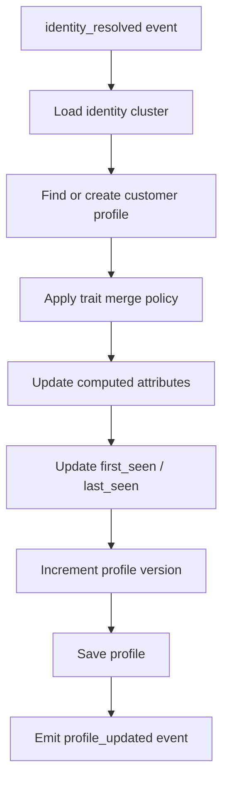

# Customer Profile Unification

## Purpose

Customer Unification answers this question:

```text
What is the final customer profile after merging all resolved identities and events?
```

It consumes identity-resolved events and updates a unified customer profile.

## Relationship to Identity Resolution

Identity Resolution decides which identifiers belong together.

Customer Unification builds and updates the profile for that identity cluster.

```text
Identity cluster -> Unified customer profile
```

## Unified profile example

```json
{
  "customer_id": "customer_001",
  "tenant_id": "tenant_001",
  "identity_cluster_id": "cluster_001",
  "traits": {
    "email": "user@example.com",
    "phone": "+8490...",
    "name": "Nguyen Van A",
    "country": "VN"
  },
  "computed_attributes": {
    "total_events": 25,
    "total_orders": 3,
    "last_event_name": "product_viewed",
    "last_product_viewed": "p001"
  },
  "first_seen_at": "2026-06-01T00:00:00Z",
  "last_seen_at": "2026-06-30T03:00:00Z",
  "version": 12
}
```

## Data model

```sql
customer_profile (
  id,
  tenant_id,
  canonical_user_id,
  identity_cluster_id,
  traits_json,
  computed_attributes_json,
  first_seen_at,
  last_seen_at,
  version,
  created_at,
  updated_at
)

customer_profile_history (
  id,
  tenant_id,
  customer_profile_id,
  event_id,
  change_type,
  before_json,
  after_json,
  created_at
)
```

## Profile update flow



## Merge policy

Merge policy must be explicit.

Initial recommended policy:

| Field | Rule |
|---|---|
| `email` | Latest non-empty verified value wins. |
| `phone` | Latest non-empty verified value wins. |
| `name` | Latest non-empty value wins. |
| `country` | Latest non-empty value wins. |
| `first_seen_at` | Earliest timestamp wins. |
| `last_seen_at` | Latest timestamp wins. |
| `total_events` | Increment per accepted event. |
| `last_event_name` | Latest event wins. |
| `last_product_viewed` | Latest `product_viewed` event wins. |

Version 1 can keep merge policy in code.

Later versions may support tenant-configurable merge policy.

## Computed attributes

Start with simple attributes:

```text
total_events
first_seen_at
last_seen_at
last_event_name
last_source_id
last_page_url
last_product_viewed
total_orders
last_order_at
```

Do not start with complex windowed attributes until the event pipeline is stable.

Future attributes:

```text
view_count_7d
purchase_count_30d
cart_abandoned_24h
predicted_ltv
churn_risk_score
```

## Concurrency

Profile updates can race when multiple events for the same customer are processed in parallel.

Use one or more of these strategies:

1. Kafka partition key by customer identity.
2. Optimistic locking with `version`.
3. Retry on version conflict.
4. Per-customer lock if absolutely necessary.

Recommended first version:

```text
Kafka partition key + optimistic locking
```

## Profile updated event

After update, emit:

```json
{
  "event_type": "profile_updated",
  "tenant_id": "tenant_001",
  "event_id": "evt_001",
  "customer_profile_id": "profile_001",
  "canonical_user_id": "customer_001",
  "identity_cluster_id": "cluster_001",
  "changed_fields": [
    "traits.email",
    "computed_attributes.total_events",
    "last_seen_at"
  ],
  "profile_version": 12,
  "updated_at": "2026-06-30T03:00:03Z"
}
```

## Profile query API

Initial APIs:

```http
GET /v1/admin/profiles/{profile_id}
GET /v1/admin/profiles?email=...
GET /v1/admin/profiles?phone=...
GET /v1/admin/profiles/{profile_id}/events
GET /v1/admin/profiles/{profile_id}/segments
GET /v1/admin/profiles/{profile_id}/identity-cluster
```

Admin query must respect RBAC and PII masking.

## Profile rebuild

The system should eventually support rebuilding a profile from raw events.

Version 1 can implement manual rebuild for one customer.

Future version can support bulk replay.

## Implementation notes (Phase 6)

- Runs as a dedicated consumer group (`<group>-profile`) on `cdp.identity-resolved`. The
  `identity_resolved` event embeds the original envelope, so no second lookup is needed.
- Concurrency uses a pessimistic row lock (`SELECT … FOR UPDATE` on the profile) plus the
  partition-keyed `identity_resolved` topic (`tenant_id|canonical_user_id`), which serializes
  per-customer updates. The `version` column is still bumped for the event/history (a belt-and-suspenders
  optimistic check is applied on update).
- Idempotency by `event_id` is enforced by `customer_profile_history` with
  `UNIQUE (tenant_id, customer_profile_id, event_id)`; that table doubles as the change log
  (before/after JSON). A re-delivered event is a no-op (no double-count, no re-emit).
- `first_seen_at`/`last_seen_at` are profile columns; `total_events`, `total_orders`,
  `last_event_name`, `last_source_id`, `last_page_url`, `last_product_viewed`, `last_order_at` live in
  `computed_attributes_json`. Merge policy is in code (`internal/profile/merge.go`).
- `profile_updated` is published to `cdp.profile-updated` (key `tenant_id|canonical_user_id`).
- The profile query API returns traits as-is to admins; field-level PII masking and RBAC are Phase 9.
  "verified" trait semantics are deferred (all values treated as latest-non-empty-wins).

## Acceptance criteria

- [ ] Create profile from first resolved event.
- [ ] Update existing profile from later events.
- [ ] Apply explicit merge policy.
- [ ] Maintain `first_seen_at` and `last_seen_at` correctly.
- [ ] Update computed attributes.
- [ ] Use `version` or safe concurrency control.
- [ ] Emit `profile_updated` event.
- [ ] Profile can be queried from admin API.
- [ ] PII masking is supported in admin view.
- [ ] Profile update is idempotent by `event_id`.
