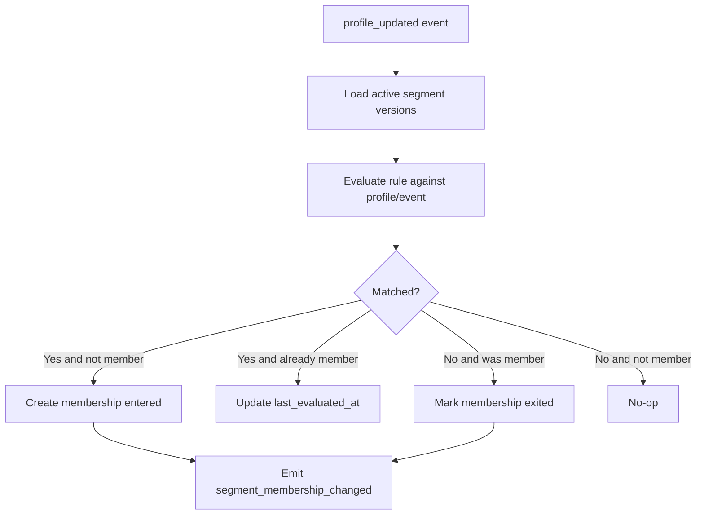

# Segmentation Engine

## Purpose

Segmentation answers this question:

```text
Which customers belong to which audiences?
```

The segmentation engine evaluates rules against customer profiles and events, then updates segment membership.

## Implementation strategy

Build segmentation in levels.

```text
Level 1: Stateless segmentation
Level 2: Profile-attribute segmentation
Level 3: Stateful behavioral segmentation
```

Start with Level 1 and Level 2.

Do not start with complex stateful segmentation.

## Level 1 — Stateless segmentation

Stateless segmentation evaluates a rule using:

```text
current event
current profile
segment definition
```

Example:

```text
profile.country = "VN"
AND event.name = "product_viewed"
AND event.properties.category = "phone"
```

Good for:

- Real-time triggers.
- Simple audiences.
- Campaign targeting.
- Webhook activation.
- Push notification activation.

## Level 2 — Profile-attribute segmentation

Profile-attribute segmentation evaluates only profile fields.

Example:

```text
profile.total_orders > 3
AND profile.membership_tier = "gold"
```

Good for:

- Saved audiences.
- Batch export.
- Campaign target lists.

## Level 3 — Stateful behavioral segmentation ✅ shipped

Stateful segmentation evaluates behavior over time. The flagship works end-to-end:

```text
Viewed product at least 3 times in 7 days
AND did not purchase within 24 hours
```

— evaluated at event time **and** fired by a deadline sweeper with no inbound event
(including for dormant profiles). Design of record: [16 — Level 3 Stateful Behavioral
Segmentation](16-stateful-segmentation.md); build plan: [17 — Implementation
Plan](17-stateful-segmentation-implementation.md). It was built in-process (Postgres,
no Kafka-Streams/Flink/Redis) as: a durable partitioned `behavioral_event` log +
hourly `profile_behavior_bucket` rollups, a clock-injected windowed evaluator, atomic
outbox-emitted membership, and a per-tenant-fair deadline sweeper.

### Windowing support matrix

| Behaviour kind | Served from |
|---|---|
| `count` / `frequency` (threshold) | **bucket** rollup (exact via boundary-hour correction), or exact log if `where`/`value_prop` |
| `recency` / `absence` | exact `MAX(occurred_at)` index lookup |
| correlated `absence` (with anchor) | exact log |
| `sequence` | exact log (ordered self-join) |
| frequency-of-value (`value_prop`) | exact log |

A behavioural `due_at` deadline is armed only for **sweep-safe** rules (no stateless
`event.*` leaf). `count`/`recency`/`absence`/correlated-`absence` each arm an exact
elapse deadline (e.g. `last(anchor)+W` for correlated absence); only `sequence` has no
cheap elapse deadline and relies on the safety sweep. `sequence`, correlated `absence`,
`where`, and `value_prop` are always exact (never bucket-served).

**Known limitations:** retention keeps data for `max(BEHAVIOR_RETENTION, longest active
window + margin)`, so no in-window data is pruned. Event **property-shape drift** (a
`where`/`value_prop` property changing type mid-window) is **not yet detected** and can
silently mis-evaluate those windows — schema-version drift detection (doc 16 finding
#33) is deferred.

## Segment model

```sql
segment (
  id,
  tenant_id,
  name,
  description,
  status,
  current_version_id,
  created_at,
  updated_at
)

segment_version (
  id,
  tenant_id,
  segment_id,
  version,
  rule_json,
  status,
  created_at
)

segment_membership (
  tenant_id,
  segment_id,
  customer_profile_id,
  status,
  entered_at,
  exited_at,
  last_evaluated_at,
  version
)
```

## Rule DSL

Use a JSON DSL first. It is easier for UI and AI agents to generate safely.

Example:

```json
{
  "operator": "and",
  "conditions": [
    {
      "field": "profile.traits.country",
      "op": "eq",
      "value": "VN"
    },
    {
      "field": "event.event_name",
      "op": "eq",
      "value": "product_viewed"
    },
    {
      "field": "event.properties.category",
      "op": "eq",
      "value": "phone"
    }
  ]
}
```

## Supported operators for version 1

Comparison:

```text
eq
neq
gt
gte
lt
lte
contains
not_contains
in
not_in
exists
not_exists
```

Logical:

```text
and
or
not
```

Temporal operators can be added later:

```text
within_last
before
after
between
```

## Evaluation flow



## Segment membership event

```json
{
  "event_type": "segment_membership_changed",
  "tenant_id": "tenant_001",
  "segment_id": "segment_001",
  "segment_version_id": "segment_version_003",
  "customer_profile_id": "profile_001",
  "change": "entered",
  "reason_event_id": "evt_001",
  "changed_at": "2026-06-30T03:00:04Z"
}
```

Possible changes:

```text
entered
exited
updated
```

## Segment versioning

Rules:

- Editing a segment creates a new segment version.
- Membership should record the segment version that produced it.
- Old segment versions should be kept for audit.
- Activation should use the current active segment version unless configured otherwise.

## Performance considerations

Version 1 can load active segments and evaluate them in memory if the number of segments is small.

When segment count grows:

- Index segments by referenced fields.
- Precompile segment rules.
- Cache active segment definitions.
- Evaluate only affected segments based on changed profile fields/event name.

## Implementation notes (Phase 7)

- Runs as a dedicated consumer group (`<group>-segment`) on `cdp.profile-updated`. To evaluate
  Level-1 `event.*` fields, `profile_updated` now embeds the reason envelope (additive field).
- Rules are validated (`internal/segment/dsl.go`) on create/edit before activation. Editing a segment
  creates a new `segment_version` and repoints `segment.current_version_id`; membership records the
  version that produced it.
- The evaluator (`internal/segment/eval.go`) supports all v1 operators; field paths resolve over
  `profile.traits.*`, `profile.computed_attributes.*`, `profile.{canonical_user_id,first_seen_at,
  last_seen_at}`, and `event.{event_name,type,properties.*,context.*}`. Missing fields are false for
  comparisons (only `not_exists` is true).
- Membership transitions emit `segment_membership_changed` to `cdp.segment-membership-changed`
  (key `tenant_id|canonical_user_id`) only on enter/exit; a re-delivered `profile_updated` converges
  (idempotent, no duplicate emit). Per-customer updates are serialized by the partition key.
- Phase 7 evaluates all active segments per event (fine for small segment counts). Admin API and
  membership are returned raw; RBAC/PII masking are Phase 9.

## Acceptance criteria

- [ ] Admin can create segment.
- [ ] Segment rules are versioned.
- [ ] Rule JSON is validated before activation.
- [ ] Evaluator supports version 1 operators.
- [ ] Profile/event can be evaluated against active segments.
- [ ] Segment membership is created on match.
- [ ] Segment membership exits when rule no longer matches.
- [ ] `segment_membership_changed` event is emitted.
- [ ] Evaluation is idempotent.
- [ ] Tests cover all operators.
