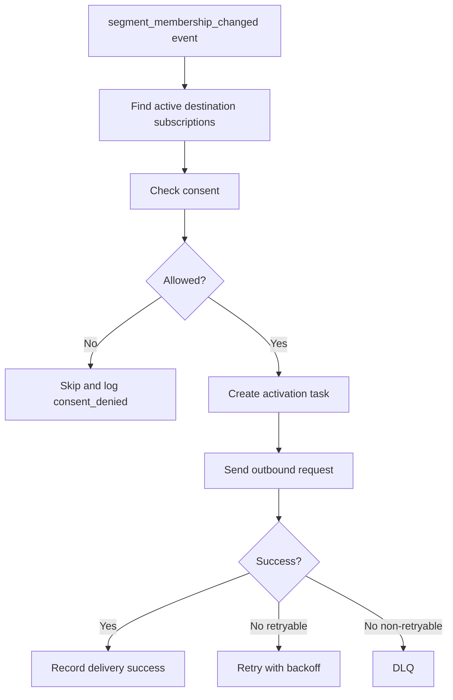

# Activation / Outgress

## Purpose

Activation sends customer data, events, or segment membership changes to downstream systems.

Examples:

- Webhook.
- Kafka topic.
- Push notification system.
- Email platform.
- CRM.
- Ads platform.
- Data warehouse.

## First version destinations

Build only these first:

```text
Webhook destination
Kafka destination
Internal push notification destination
```

Defer:

```text
Ads integrations
Email editor
CRM deep sync
Warehouse reverse ETL
Complex campaign/journey builder
```

## Activation flow



## Destination model

```sql
destination (
  id,
  tenant_id,
  type,
  name,
  status,
  config_json,
  secret_ref,
  created_at,
  updated_at
)

destination_subscription (
  id,
  tenant_id,
  destination_id,
  trigger_type,
  segment_id,
  event_name,
  status,
  created_at,
  updated_at
)
```

Destination types:

```text
webhook
kafka
push
email
crm
ads
warehouse
```

## Activation task model

```sql
activation_task (
  id,
  tenant_id,
  destination_id,
  subscription_id,
  customer_profile_id,
  source_event_id,
  idempotency_key,
  payload_json,
  status,
  attempt_count,
  next_attempt_at,
  last_error,
  created_at,
  updated_at
)
```

Task statuses:

```text
pending
sending
succeeded
failed_retryable
failed_permanent
dlq
skipped
```

## Delivery log model

```sql
activation_delivery (
  id,
  tenant_id,
  activation_task_id,
  destination_id,
  customer_profile_id,
  source_event_id,
  idempotency_key,
  status,
  http_status,
  response_body_hash,
  error_message,
  attempt_count,
  sent_at,
  created_at
)
```

## Idempotency

Activation idempotency key:

```text
tenant_id + destination_id + subscription_id + customer_profile_id + source_event_id + change_type
```

Requirements:

- Same activation event must not be sent twice to the same destination.
- Retry must reuse same idempotency key.
- Webhook should include `Idempotency-Key` header.
- Delivery log must record all attempts.

## Webhook destination

Webhook config:

```json
{
  "url": "https://example.com/webhook",
  "method": "POST",
  "headers": {
    "X-Custom-Header": "value"
  },
  "timeout_ms": 5000,
  "max_retries": 5
}
```

Webhook request headers:

```http
Content-Type: application/json
Idempotency-Key: <key>
X-CDP-Tenant-Id: <tenant_id>
X-CDP-Event-Id: <event_id>
X-CDP-Destination-Id: <destination_id>
```

Payload example:

```json
{
  "type": "segment_membership_changed",
  "tenant_id": "tenant_001",
  "segment_id": "segment_001",
  "customer": {
    "id": "customer_001",
    "traits": {
      "country": "VN"
    },
    "computed_attributes": {
      "total_orders": 3
    }
  },
  "change": "entered",
  "occurred_at": "2026-06-30T03:00:04Z"
}
```

## Retry policy

Recommended first version:

```text
max_retries = 5
backoff = exponential
initial_delay = 10 seconds
max_delay = 15 minutes
jitter = true
```

Retryable failures:

```text
HTTP 408
HTTP 429
HTTP 500
HTTP 502
HTTP 503
HTTP 504
network timeout
connection reset
```

Permanent failures:

```text
HTTP 400
HTTP 401
HTTP 403
HTTP 404
invalid destination config
payload transformation error
consent denied
```

## Circuit breaker

Destination-level circuit breaker should be added when repeated failures occur.

Initial simple rule:

```text
If destination has more than N failures in M minutes, pause sending for cooldown period.
```

## Consent check

Before sending activation:

```text
Load customer consent
Check destination channel and purpose
Skip if denied
Record skipped reason
```

Never send marketing activation if consent is denied.

## Implementation notes (Phase 8)

- A dedicated consumer group (`<group>-activation`) on `cdp.segment-membership-changed` creates one
  `activation_task` per active subscription (idempotent on `(tenant_id, idempotency_key)`), snapshotting
  the payload. A separate **sender loop** (relay-style, `FOR UPDATE SKIP LOCKED`) claims due tasks,
  sends, and reschedules `next_attempt_at` with exponential backoff (10s→15min, max 5).
- Webhook responses classify as success (2xx), retryable (408/429/5xx + network/timeout), or permanent
  (other 4xx). Each attempt writes an `activation_delivery` row. Webhooks send `Idempotency-Key`,
  `X-CDP-Tenant-Id`, `X-CDP-Event-Id`, `X-CDP-Destination-Id` headers.
- Kafka destinations produce the payload to the configured `config.topic`.
- Disabling a destination (status) stops new tasks (the subscription join requires both active).
- **Deferred to Phase 9:** the consent gate (`customer_consent` + skip-on-denied), destination-secret
  encryption, RBAC. Phase 8 stores `config_json`/`secret_ref` as-is and sends without a consent check.
- Deferred to later: push/email/CRM/ads/warehouse destinations, event-triggered subscriptions,
  circuit breaker, per-destination `max_retries` override.

## Acceptance criteria

- [ ] Admin can create webhook destination.
- [ ] Admin can create Kafka destination.
- [ ] Destination secrets are encrypted.
- [ ] Segment membership change creates activation task.
- [ ] Activation task sends payload to destination.
- [ ] Retry works for retryable failures.
- [ ] Permanent failures go to DLQ or failed state.
- [ ] Delivery log records attempts.
- [ ] Idempotency prevents duplicate sends.
- [ ] Consent is checked before sending.
- [ ] Destination can be disabled.
