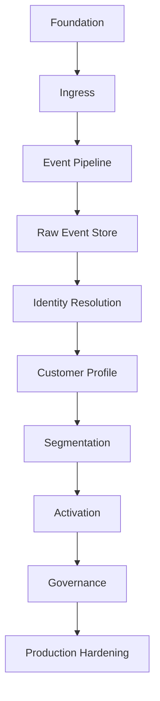

# Implementation Roadmap

## Goal

Build the CDP in a production-grade order: foundation first, then processing, then segmentation and activation, then hardening.

Avoid building advanced campaign or journey features before the core CDP pipeline is stable.

## Recommended roadmap



## Phase 1 — Foundation

Build:

- Project structure.
- Database migration system.
- Tenant model.
- Source model.
- API key auth.
- Common error response.
- Structured logging.
- Audit log foundation.
- Local Docker Compose.

Deliverable:

```text
Admin can create tenant and source. Source gets API key. Ingress can authenticate source.
```

Acceptance criteria:

- [ ] Application starts locally with PostgreSQL and Kafka/Redpanda.
- [ ] Migration runs automatically or through a command.
- [ ] Tenant table exists.
- [ ] Source table exists.
- [ ] API key is generated, hashed, and validated.
- [ ] Logs are structured.
- [ ] Audit log can record config changes.

## Phase 2 — Ingress API

Build:

```http
POST /v1/events/track
POST /v1/events/batch
POST /v1/identify
POST /v1/alias
```

Deliverable:

```text
Events can be received, validated, normalized, and published.
```

Acceptance criteria:

- [ ] Ingress resolves tenant/source from API key.
- [ ] Event envelope is normalized.
- [ ] `received_at` is set by server.
- [ ] Duplicate `event_id` is idempotent.
- [ ] Invalid events are rejected with clear error.
- [ ] Batch ingestion works.

## Phase 3 — Event Pipeline

Build:

- Kafka/Redpanda topics.
- Producer abstraction.
- Consumer abstraction.
- Retry strategy.
- DLQ producer.
- Consumer lag metric.

Initial topics:

```text
cdp.events
cdp.profile-updated
cdp.segment-membership-changed
cdp.activation
cdp.dlq
```

Deliverable:

```text
Event moves reliably from API to worker.
```

Acceptance criteria:

- [ ] API publishes event to topic.
- [ ] Worker consumes event.
- [ ] Worker errors are retried.
- [ ] Retry exhaustion sends event to DLQ.
- [ ] Processing lag is visible.

## Phase 4 — Raw Event Store

Build:

- `raw_event` table.
- Store normalized event payload.
- Payload hash.
- Event query API.
- Basic replay for one event/customer.

Deliverable:

```text
Events can be debugged and replayed.
```

Acceptance criteria:

- [ ] Each accepted event is stored.
- [ ] Duplicate event is not stored twice.
- [ ] Admin can query event by tenant/event ID.
- [ ] Admin can query events by customer identifier if available.

## Phase 5 — Identity Resolution

Build:

- `identity_node`.
- `identity_cluster`.
- `identity_cluster_member`.
- `identity_merge_history`.
- Identifier normalization.
- Deterministic matching.
- Cluster merge.
- `identity_resolved` internal event.

Deliverable:

```text
anonymous_id, user_id, email, and phone can resolve to one customer.
```

Acceptance criteria:

- [ ] Identity nodes are created.
- [ ] Identity clusters are created.
- [ ] `identify` can merge anonymous and known user.
- [ ] `alias` can merge identities.
- [ ] Merge is tenant-scoped.
- [ ] Merge is idempotent.
- [ ] Merge history is recorded.

## Phase 6 — Customer Profile

Build:

- `customer_profile`.
- Trait merge policy.
- Computed attributes.
- Profile versioning.
- Profile update worker.
- `profile_updated` event.

Deliverable:

```text
Unified customer profile is built from identity-resolved events.
```

Acceptance criteria:

- [ ] First event creates profile.
- [ ] Later event updates profile.
- [ ] Merge policy is explicit.
- [ ] `first_seen_at` and `last_seen_at` are correct.
- [ ] `total_events` increments idempotently.
- [ ] Profile update emits event.

## Phase 7 — Stateless Segmentation

Build:

- Segment table.
- Segment version table.
- JSON rule DSL.
- Rule validator.
- Rule evaluator.
- Segment membership table.
- Segment membership changed event.

Deliverable:

```text
Customer can enter or exit a segment in real time.
```

Acceptance criteria:

- [ ] Admin can create segment.
- [ ] Segment rules are versioned.
- [ ] Evaluator supports version 1 operators.
- [ ] Profile/event can be evaluated.
- [ ] Membership is updated.
- [ ] Membership change emits event.

## Phase 8 — Activation

Build:

- Destination table.
- Destination subscription table.
- Webhook destination.
- Kafka destination.
- Activation task table.
- Delivery log table.
- Retry/backoff.
- Idempotency key.

Deliverable:

```text
Segment membership changes can be sent to downstream destinations.
```

Acceptance criteria:

- [ ] Admin can create destination.
- [ ] Segment can be connected to destination.
- [ ] Activation task is created from membership change.
- [ ] Webhook is sent.
- [ ] Retry works.
- [ ] Delivery log records result.
- [ ] Duplicate activation is prevented.

## Phase 9 — Governance

Build:

- RBAC.
- PII masking.
- Consent model.
- Consent check before activation.
- API key rotation.
- Destination secret encryption.
- Profile export/delete.

Deliverable:

```text
The CDP is safer for production customer data.
```

Acceptance criteria:

- [ ] Admin permissions are enforced.
- [ ] PII is masked where needed.
- [ ] Destination secrets are encrypted.
- [ ] Consent is checked before activation.
- [ ] Customer data can be exported.
- [ ] Customer data can be deleted/anonymized.

## Phase 10 — Production Hardening

Build/improve:

- Load tests.
- Failure tests.
- Backup/restore.
- Replay tool.
- Metrics dashboard.
- DLQ admin screen.
- Rate limiting.
- Circuit breaker.
- Alerting.

Deliverable:

```text
System can run in production with operational visibility and recovery tools.
```

Acceptance criteria:

- [ ] Load test completed.
- [ ] Worker crash recovery tested.
- [ ] Kafka outage behavior tested.
- [ ] Destination outage behavior tested.
- [ ] DLQ retry tested.
- [ ] Backup/restore tested.
- [ ] Alerts configured.

## Suggested timeline

```text
Month 1:
- Foundation
- Ingress API
- Event pipeline
- Raw event store
- DLQ basics

Month 2:
- Identity Resolution
- Customer Profile Store
- Profile merge policy
- Profile updated event
- Admin profile/event viewer

Month 3:
- Stateless Segmentation
- Segment membership
- Webhook/Kafka activation
- Delivery logs
- Retry/circuit breaker

Month 4:
- Consent/governance
- RBAC
- PII masking/encryption
- Data retention
- Load testing
- Production hardening
```
