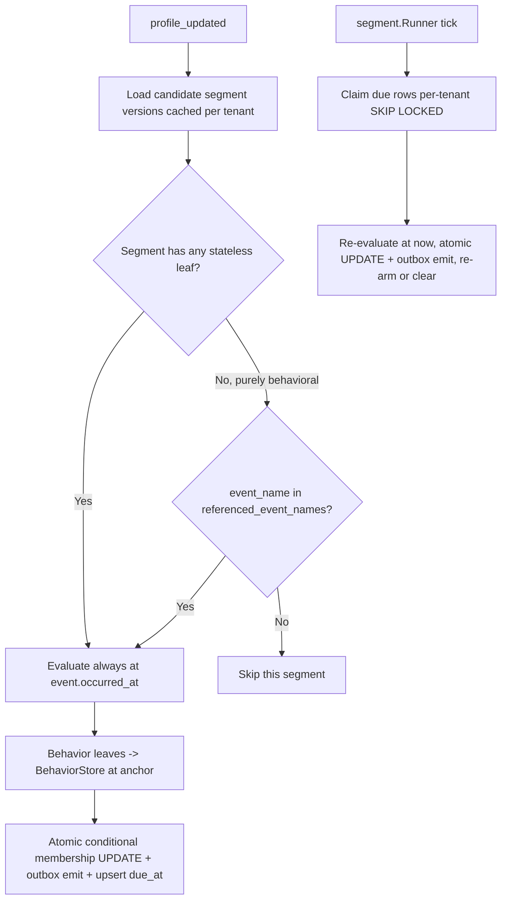

# 16 — Level 3 Stateful Behavioral Segmentation

**Status:** Proposed design (not yet implemented). Treat as an implementation blueprint, the way
[15 — Future Enhancements](15-future-enhancements.md) treats its backlog. Scope: `internal/segment`,
`internal/profile`, `internal/governance`, `cmd/cdp-worker`, a new `internal/behavior` package, and
migrations `00011`–`00013`. Grounded against branch `enhance/identity`.

This document extends [06 — Segmentation Engine](06-segmentation-engine.md), which builds
segmentation in levels and explicitly defers Level 3 (`docs/cdp/06-segmentation-engine.md:70-88`).
Levels 1 and 2 ship today as the stateless evaluator in `internal/segment`. This is the Level 3
plan: windowed behaviour over time, evaluated inside the existing PostgreSQL + Redpanda monolith with
no new stateful infrastructure.

---

## Motivation

Stateless segmentation (Level 1/2) answers *"does this profile+event match right now?"* — it is
edge-triggered by `cdp.profile-updated` and evaluates a rule against the current profile snapshot and
the reason event (`internal/segment/service.go:66` `Evaluate`, `internal/segment/eval.go:21`). It
structurally cannot answer questions about **accumulated behaviour** or **the absence of behaviour**:

- *"Viewed a product ≥ 3 times in the last 7 days."* — needs a count over history, not one event.
- *"Did **not** purchase within 24 hours."* — the transition to matched happens when **time
  elapses with no inbound event**. The current engine only ever runs when an event arrives
  (`cmd/cdp-worker/main.go:129` segment consumer over `cdp.profile-updated`), so a "did-not-do"
  transition can never fire.
- *"Add-to-cart then checkout-started within 1 hour, in that order."* — needs an ordered multi-event
  sequence within a span.

The flagship target from `docs/cdp/06-segmentation-engine.md:76-79` combines two of these:

```text
Viewed product at least 3 times in 7 days
AND did not purchase within 24 hours
```

### Concrete example rules this design must support

| Audience | Shape |
|----------|-------|
| Cart abandoners | `count(product_viewed) ≥ 3 in 7d` **AND** no `order_completed` in the 24h after the qualifying views |
| High-value cart abandoners in the US | `profile.traits.country = US` **AND** `count(add_to_cart where price ≥ 100) ≥ 1 in 3d` **AND** `absence(order_completed, 3d)` |
| Churn risk | `recency(login) not within 30d` (no login for 30 days) |
| VIP by spend | `frequency-of-value(order_completed.revenue) ≥ 500 in 30d` |
| Funnel drop | `sequence(add_to_cart → checkout_started within 1h)` with no `order_completed` between |

---

## Chosen architecture, and why

**Primary mechanism: `incremental-agg` — per-`(tenant, profile, event_name)` tumbling counter
buckets in Postgres, upserted in the same transaction as the profile update, read as bounded
primary-key range scans, with a deadline-queue ticker for absence/expiry transitions. Grafted with a
durable per-profile `behavioral_event` log that provides exact-to-the-second counts, correlated
absence, multi-step sequences, and rebuild/backfill.**

Two Postgres-native designs are two ends of one spectrum — cheap lossy aggregates versus exact
expensive re-query — and the right answer combines them:

- **`profile_behavior_bucket`** is the **hot path**. Each event is an `O(1)` upsert
  (`count+1`, `LEAST(first_at)`, `GREATEST(last_at)`) piggybacked on the *existing* profile
  `updateTx` (`internal/profile/service.go:106`) behind the *existing* `alreadyApplied` idempotency
  ledger check (`internal/profile/service.go:148`). This buys **exactly-once counters with no new
  dedup table**, and a windowed read is a bounded PK range scan.
- **`behavioral_event`** is the **durable, profile-keyed log** — one cheap append per event — that
  (a) serves exact-boundary counts, correlated absence, and ordered sequences by re-querying history
  (the shapes buckets are honestly weak at), and (b) is the **rebuild/backfill source** when a
  stateful segment is activated, a window is widened, or buckets drift. `raw_event` **cannot** serve
  this: it is keyed only by `identifier_key`, with no profile id (`migrations/00003_raw_event.sql`).
- **`segment_pending_eval`** is the **deadline queue** swept by a new `segment.Runner`, cloned from
  `internal/activation/runner.go:39` using `FOR UPDATE SKIP LOCKED` (`internal/activation/repo.go:200`).
  This is the only mechanism that can fire *"did NOT purchase within 24h"* and *"count aged below 3
  as the window slid"* — transitions with **no inbound event**.

### Why this over the alternatives

| Approach | Fit | Op. simplicity | Verdict | Reason |
|----------|-----|----------------|---------|--------|
| **incremental-agg + postgres-window log (chosen)** | High | High | **Adopt** | Zero new infra: PostgreSQL 16 + Redpanda + the proven `SKIP LOCKED` claim loop. Net footprint 3 tables + 1 goroutine. Reuses the whole downstream contract unchanged. |
| **postgres-window only** | High | High | Fold in | Exact but expensive per-event re-query; adopted as the exact/sequence/backfill backbone, not the hot path. |
| **redis-worker** | Med | Low | Reject | Introduces Redis: a new stateful container, SPOF, dual-write consistency, HA/AOF/eviction ops — absent from `go.mod` and `deploy/docker-compose.yml`. Still needs a Postgres mirror for durability, so it pays the Postgres cost **plus** Redis ops. Violates "avoid heavy new infra unless justified". Kept as a documented scale-escalation path. |
| **stream-processing (Kafka Streams / Flink)** | Low | Low | Reject | No Kafka Streams for Go (`go.mod` is franz-go/pgx/goose). Hand-reimplementing state stores, changelog topics, standby replicas, rebalance state migration, and timers is a multi-month distributed-systems build; the Flink path bolts a JVM cluster onto a Go shop. Reserved for if/when high-volume CEP becomes a core product requirement. |

Additional reasons the chosen design fits:

- **Reuses the downstream contract.** The membership state machine
  (`repo.Enter`/`Exit`/`TouchEvaluated`, `internal/segment/service.go:93`), the `MembershipChanged`
  event (`internal/segment/service.go:33`), and the entire activation consumer are unchanged once a
  stateful `matched` bool is computed.
- **Backward compatible.** One `omitempty` leaf variant on `Rule`; every stored `rule_json` and
  every stateless L1/L2 rule parses and evaluates byte-for-byte identically.

---

## Architecture

The pipeline shape is unchanged. We add **one write hook**, **one read resolver**, **one ticker**,
and route all membership emits through the **existing transactional outbox**. Each stage remains an
independent franz-go consumer group over one topic (`cmd/cdp-worker/main.go:run`).

```text
cdp.events ─▶ [-identity] ─▶ cdp.identity-resolved ─▶ [-profile] ─▶ cdp.profile-updated ─▶ [-segment] ─▶ cdp.segment-membership-changed ─▶ [-activation]
                                                          │                                    │
                                    (1) WRITE (same tx as updateTx):        (2) READ: BehaviorStore resolves behavior.*
                                        append behavioral_event + upsert     leaves at the event's occurred_at anchor;
                                        profile_behavior_bucket behind        edge path drives the atomic membership
                                        alreadyApplied (exactly-once)         switch and upserts next-boundary due_at
                                                                                    │
                                    (3) SWEEP: new segment.Runner ticks ────────────┘
                                        claims segment_pending_eval (per-tenant-fair, SKIP LOCKED),
                                        re-evaluates (segment,profile) at now(), fires absence/expiry.
                                        Edge AND sweep write flip + membership-changed row in ONE tx
                                        into the outbox; the relay drains it at-least-once.
```



Component changes:

1. **New `internal/behavior` package** — owns `behavioral_event`, `profile_behavior_bucket`,
   `segment_pending_eval`. Exposes `Recorder` (tx-scoped write) and `Store` (windowed reads). Keeps
   stateful storage self-contained; `profile` depends on it only through a nil-safe hook interface so
   there is no hard `profile → segment` coupling.
2. **`profile.Service` gains a nil-safe `BehaviorRecorder` hook** (mirroring the existing nil-safe
   `OnUpdated`, `Audit`, `Logger` fields at `internal/profile/service.go:61-66`). `updateTx` calls it
   **inside the tx**, after `alreadyApplied` returns false, using the same `tx` handle, so the
   append + bucket upsert commit atomically with the profile change and are skipped on idempotent
   redelivery. This is where exactly-once comes from for free.
3. **`internal/segment` grows a `BehaviorStore` dependency and a stateful `Evaluate` path** — a
   `Behavior != nil` leaf resolves against the store; the stateless comparison/logical evaluator
   (`internal/segment/eval.go`) is otherwise untouched.
4. **New `segment.Runner`** goroutine wired in `cmd/cdp-worker/main.go` beside `activationRunner`
   (`cmd/cdp-worker/main.go:151`,`:166`), bumping `wg.Add(8)` → `9` at `cmd/cdp-worker/main.go:164`.
5. **Membership emits move onto the outbox.** Both the edge path and the sweep write the membership
   flip **and** a `segment_membership_changed` outbox row in one DB transaction; the existing
   `relay.New` drains it (`cmd/cdp-worker/main.go:85`). This makes flip + emit atomic and durable.

---

## DSL extension

Add **one** `omitempty` leaf variant to the recursive `Rule` (`internal/segment/dsl.go:39`). A `Rule`
with no `behavior` field is exactly today's logical/comparison node, so all stored `rule_json` and
every L1/L2 rule parse and evaluate identically. `segment_version` is append-only, so old versions
keep their exact semantics.

```go
// internal/segment/dsl.go
type Rule struct {
    Operator   string        `json:"operator,omitempty"`
    Conditions []Rule        `json:"conditions,omitempty"`
    Field      string        `json:"field,omitempty"`
    Op         string        `json:"op,omitempty"`
    Value      any           `json:"value,omitempty"`
    Behavior   *BehaviorSpec `json:"behavior,omitempty"` // NEW — omitempty => byte-for-byte back-compat
}

type BehaviorSpec struct {
    Kind      string         `json:"kind"`                 // count | frequency | recency | absence | sequence
    EventName string         `json:"event_name,omitempty"` // e.g. "product_viewed"; required for non-sequence
    Window    string         `json:"window,omitempty"`     // "7d","24h","30m" — parsed to time.Duration
    Op        string         `json:"op,omitempty"`         // count/frequency: gte|gt|lte|lt|eq
    Value     float64        `json:"value,omitempty"`      // threshold
    ValueProp string         `json:"value_prop,omitempty"` // frequency-of-value: sums this numeric property
    Where     *Rule          `json:"where,omitempty"`      // OPTIONAL props filter — reuses the comparison-leaf grammar
    Steps     []BehaviorSpec `json:"steps,omitempty"`      // sequence: ordered A,B,...
    Within    string         `json:"within,omitempty"`     // sequence: max span between consecutive steps
    Anchor    *BehaviorSpec  `json:"anchor,omitempty"`     // correlated absence: "no E within Window AFTER the anchor behavior"
    Exact     bool           `json:"exact,omitempty"`      // force the behavioral_event re-query path
}
```

`Validate` (`internal/segment/dsl.go:57`) gets a mutually-exclusive branch: when `Behavior != nil`,
`Operator`/`Field`/`Op`/`Value` must be empty; `Kind` must be known; `Window`/`Within` must parse;
`count`/`frequency` require `Op`+`Value` and a non-empty `EventName`; `sequence` requires `Steps`.
`handler.go` already calls `Validate` on Create (`internal/segment/handler.go:44`) and Update
(`internal/segment/handler.go:81`), so bad windowed rules are rejected at admin time. **Validation
also force-sets `Exact` (or rejects `exact:false`)** for any leaf that buckets cannot serve honestly:
`kind=sequence`, any leaf with a non-nil `Where`, any `value_prop` combined with `Where`, and any
correlated-absence `Anchor` (see [Evaluation semantics](#evaluation-semantics)). Validation also
**rejects `exact`/`sequence` on event names flagged high-frequency** (see [Performance](#performance)).

### JSON examples

**Flagship — "viewed a product ≥ 3 times in 7 days AND did not purchase within 24h *of* the
qualifying views"** (correlated absence, exact path):

```json
{ "operator": "and", "conditions": [
  { "behavior": { "kind": "count", "event_name": "product_viewed",
                  "window": "7d", "op": "gte", "value": 3 } },
  { "behavior": { "kind": "absence", "event_name": "order_completed", "window": "24h",
                  "anchor": { "kind": "count", "event_name": "product_viewed", "window": "7d", "op": "gte", "value": 3 } } }
] }
```

The `anchor` makes the 24h relative to the qualifying behaviour, not a trailing-from-now window — the
semantic `docs/cdp/06-segmentation-engine.md:76-79` actually intends. Trailing-from-now absence is
still available (omit `anchor`) and is documented as a *different, uncorrelated* predicate.

**Mixed stateless + behaviour** ("high-value cart abandoners in the US"):

```json
{ "operator": "and", "conditions": [
  { "field": "profile.traits.country", "op": "eq", "value": "US" },
  { "behavior": { "kind": "count", "event_name": "add_to_cart", "window": "3d", "op": "gte", "value": 1,
                  "where": { "field": "event.properties.price", "op": "gte", "value": 100 } } },
  { "behavior": { "kind": "absence", "event_name": "order_completed", "window": "3d" } }
] }
```

The `where`-filtered `add_to_cart` leaf is **auto-routed to the exact `behavioral_event` path** by
`Validate` — buckets aggregate per-event props away and cannot honour it.

**Recency** (`{ "kind":"recency", "event_name":"login", "window":"24h" }` → last login within 24h),
**frequency-of-value** (`{ "kind":"frequency","event_name":"order_completed","value_prop":"revenue","window":"30d","op":"gte","value":500 }`),
and **sequence** (`{ "kind":"sequence","within":"1h","steps":[{"event_name":"add_to_cart"},{"event_name":"checkout_started"}] }`,
always exact).

An existing stateless rule is unchanged and still valid:
`{"field":"profile.computed_attributes.total_orders","op":"gte","value":1}`.

---

## Data model + migration DDL

Three new tables + segment/membership columns, via the existing goose path (`migrations/embed.go`).
The two high-write tables are **range-partitioned by time from day one** (not deferred) so retention
is `DROP PARTITION` — `O(1)`, zero dead tuples, zero vacuum churn.

### `00011_behavioral_event.sql` — durable profile-keyed log

```sql
-- +goose Up
-- Partitioned so retention = DROP PARTITION. occurred_at is CLAMPED at write time to
-- LEAST(envelope.Timestamp, received_at) so a spoofed/future client timestamp cannot
-- poison windows or defeat pruning (envelope.go:48 Timestamp vs :49 ReceivedAt).
CREATE TABLE behavioral_event (
    tenant_id           UUID NOT NULL REFERENCES tenant(id),
    customer_profile_id UUID NOT NULL,                    -- FK enforced per-partition; erasure handles delete
    event_id            TEXT NOT NULL,
    event_name          TEXT NOT NULL CHECK (event_name <> ''),
    occurred_at         TIMESTAMPTZ NOT NULL,             -- CLAMPED; partition key
    props_json          JSONB,                            -- small; backs `where` filters + exact re-query
    schema_version      INT NOT NULL DEFAULT 1,           -- detect event-shape drift across a live window
    inserted_at         TIMESTAMPTZ NOT NULL DEFAULT now(),-- server time; retention keys off THIS, not occurred_at
    PRIMARY KEY (tenant_id, customer_profile_id, event_id, occurred_at)  -- idempotent append; occurred_at is deterministic
) PARTITION BY RANGE (occurred_at);
-- Weekly partitions created ahead by the retention job; a default partition catches stragglers.

-- Workhorse index for count-in-window / absence / recency / sequence anchors.
CREATE INDEX idx_behavioral_event_window
    ON behavioral_event (tenant_id, customer_profile_id, event_name, occurred_at DESC);
-- +goose Down
DROP TABLE IF EXISTS behavioral_event;
```

The PK includes `occurred_at` (required by native partitioning). Dedup still holds: `occurred_at` is
a deterministic function of the event (the clamped envelope timestamp, stable across redeliveries), so
a redelivered `event_id` collides on the same PK and `ON CONFLICT DO NOTHING` drops it.

### `00012_profile_behavior_bucket.sql` — tumbling counters + deadline queue

```sql
-- +goose Up
CREATE TABLE profile_behavior_bucket (
    tenant_id           UUID NOT NULL REFERENCES tenant(id),
    customer_profile_id UUID NOT NULL,
    event_name          TEXT NOT NULL CHECK (event_name <> ''),
    bucket_start        TIMESTAMPTZ NOT NULL,             -- date_trunc(clamped occurred_at) to granularity (default 1h)
    count               BIGINT NOT NULL,
    first_at            TIMESTAMPTZ NOT NULL,             -- MIN(ts) in bucket — recency/sequence landmark
    last_at             TIMESTAMPTZ NOT NULL,             -- MAX(ts) in bucket — absence landmark
    sum_value           NUMERIC,                          -- optional: frequency-of-value (no `where`)
    PRIMARY KEY (tenant_id, customer_profile_id, event_name, bucket_start)
) PARTITION BY RANGE (bucket_start);

CREATE TABLE segment_pending_eval (
    tenant_id           UUID NOT NULL REFERENCES tenant(id),
    segment_id          UUID NOT NULL REFERENCES segment(id),
    customer_profile_id UUID NOT NULL,
    due_at              TIMESTAMPTZ NOT NULL,
    reason              TEXT NOT NULL,                    -- absence_deadline | window_expiry | version_change | seed | safety_sweep
    claimed_at          TIMESTAMPTZ,                      -- NULL = claimable; set on claim, time-boxed for crash recovery
    PRIMARY KEY (tenant_id, segment_id, customer_profile_id)
);
-- Claim scans due rows that are unclaimed OR whose claim has expired (crash recovery).
CREATE INDEX idx_segment_pending_due    ON segment_pending_eval (tenant_id, due_at) WHERE claimed_at IS NULL;
CREATE INDEX idx_segment_pending_claim  ON segment_pending_eval (claimed_at) WHERE claimed_at IS NOT NULL;
-- +goose Down
DROP TABLE IF EXISTS segment_pending_eval;
DROP TABLE IF EXISTS profile_behavior_bucket;
```

### `00013_segment_stateful.sql` — segment metadata + membership transition sequence

```sql
-- +goose Up
-- Populated by CreateSegment/UpdateSegment (repo.go:72/108) from the parsed rule.
ALTER TABLE segment_version ADD COLUMN is_stateful          BOOLEAN  NOT NULL DEFAULT false;
ALTER TABLE segment_version ADD COLUMN has_stateless_leaves BOOLEAN  NOT NULL DEFAULT true;
ALTER TABLE segment_version ADD COLUMN referenced_event_names TEXT[] NOT NULL DEFAULT '{}';
ALTER TABLE segment_version ADD COLUMN max_window_seconds   BIGINT   NOT NULL DEFAULT 0; -- largest window ever referenced

-- Monotonic transition counter: bumped on every real flip inside the atomic UPDATE.
-- Carried into the emit + activation idempotency key so re-entries never collide and
-- out-of-order edge/sweep emits are resolved last-writer-wins.
ALTER TABLE segment_membership ADD COLUMN transition_seq BIGINT NOT NULL DEFAULT 0;
-- +goose Down
ALTER TABLE segment_membership DROP COLUMN transition_seq;
ALTER TABLE segment_version DROP COLUMN max_window_seconds;
ALTER TABLE segment_version DROP COLUMN referenced_event_names;
ALTER TABLE segment_version DROP COLUMN has_stateless_leaves;
ALTER TABLE segment_version DROP COLUMN is_stateful;
```

`segment`, `segment_version`, and `segment_membership` (already carrying
`status/entered_at/exited_at/last_evaluated_at/version`, `migrations/00007_segment.sql:27-37`,
PK `(tenant_id, segment_id, customer_profile_id)`) are otherwise reused unchanged. Note the existing
`segment_membership.version BIGINT` (`internal/segment/repo.go:60`) stores the **segment rule
version**; we add a **separate** `transition_seq` rather than overloading it.

**Bucket upsert (executed inside `updateTx`'s tx, only for `track` events with a non-empty
`event_name`):**

```sql
INSERT INTO profile_behavior_bucket
  (tenant_id, customer_profile_id, event_name, bucket_start, count, first_at, last_at, sum_value)
VALUES ($1,$2,$3, date_trunc('hour', $4::timestamptz), 1, $4, $4, $5)  -- $4 = clamped occurred_at
ON CONFLICT (tenant_id, customer_profile_id, event_name, bucket_start) DO UPDATE
SET count     = profile_behavior_bucket.count + 1,
    first_at  = LEAST(profile_behavior_bucket.first_at, EXCLUDED.first_at),
    last_at   = GREATEST(profile_behavior_bucket.last_at, EXCLUDED.last_at),
    sum_value = COALESCE(profile_behavior_bucket.sum_value,0) + COALESCE(EXCLUDED.sum_value,0);
```

---

## Evaluation semantics

`Evaluate` becomes `Evaluate(ctx, rule, ec, store, at)` (from `internal/segment/eval.go:21`), where
`at time.Time` is an **explicit evaluation instant** passed as a SQL bind parameter (`$now`) rather
than SQL-side `now()`. This is the clock-injection pattern already established by
`internal/activation/breaker.go:16` (`now func() time.Time`), and it makes every windowed read,
`due_at` computation, and boundary case deterministically testable. A `Behavior != nil` leaf
short-circuits before `resolveField` (`internal/segment/eval.go:42`) and consults the store; the
logical/comparison paths are untouched, and a no-op store keeps existing stateless tests green. All
reads are `tenant_id`-scoped.

**Edge path uses `at = event.occurred_at` (delivery-stable); the sweep uses `at = now()`.** Anchoring
the edge evaluation to the event's own clamped timestamp — not wall-clock `now()` — means a
redelivered `profile_updated` for the same `event_id` re-evaluates over the *same* window and yields
the *same* result. This is required because the segment consumer is at-least-once: it commits offsets
only after the handler succeeds (`internal/bus/consumer.go:78` `CommitUncommittedOffsets` after
`EachRecord`, with `AtStart` reset at `:45`). `now()` is reserved for the sweep, whose entire purpose
is time-elapsed flips.

### Per-window-type semantics

- **count-in-window** — `SUM(count)` of buckets where `bucket_start >= $now - W`, compared via
  `Op`/`Value`. Bounded PK range scan. The tumbling boundary is **bidirectionally slack (±1 bucket)**:
  the leading boundary bucket is counted in full so events truly older than `$now-W` but sharing a
  bucket with in-window events **over**-count (false positive), while the trailing partial bucket is
  dropped in full (**under**-count). For equality/threshold rules where over-inclusion matters, the
  count is computed **exactly** by default — either `exact:true` (`COUNT(*)` over `behavioral_event`
  with `occurred_at >= $now-W`) or by only counting the boundary bucket when its `first_at >= $now-W`.
  Granularity is configurable per rule (finer = more rows, tighter boundary).
- **frequency** — same bucket `SUM` surfaced as a rate, or `SUM(sum_value)` for value-frequency
  (revenue/W). A `value_prop` combined with a `where` filter cannot be bucket-served (the bucket sums
  unconditionally) and is force-routed to exact.
- **recency** — `COALESCE(MAX(last_at), '-infinity') >= $now - W`, single-row read off the DESC index
  head. **Exact.** For a profile that never emitted the event, `MAX` is NULL → coalesced to
  `-infinity` → recency is correctly **false**.
- **absence / did-NOT-do-within-W** — `COALESCE(MAX(last_at), '-infinity') < $now - W`. The COALESCE
  is load-bearing: for a profile that **never** emitted the event (the strongest "did not purchase"
  case), there are zero rows and a bare `MAX(last_at) < $now-W` yields `NULL` (falsy), which
  **inverts the intended match**. Coalescing to `-infinity` makes never-emitted correctly evaluate
  **absent = true**. On the edge path, when a companion positive leaf crosses its threshold and the
  absent event has *no* history at all, the leaf is already satisfied — enter immediately (no `due_at`
  anchored to a nonexistent `last_at`).
  - **Correlated absence (`anchor` set)** — "no E within W **after** the anchor behaviour" — is
    computed on the exact `behavioral_event` path: find the anchor's occurrence time `t_a`, then test
    that no `E` exists in `[t_a, t_a + W]`. This is the flagship semantic and is exact-only.
- **sequence A→B within span** — **always** the exact `behavioral_event` ordered `LAG`/`LATERAL`
  self-join that enforces `occurred_at(B) ∈ (occurred_at(A), occurred_at(A)+Within]`. Buckets are
  **not** used for sequences: `first_at(A) < last_at(B)` across the whole window ignores `Within`
  entirely (A at t0, B at t0+5d would falsely match a `within:1h` rule), so `Validate` forces
  `exact` for `kind=sequence`. 3+ steps and "no C between A and B" use the same ordered join and are
  the costliest shape (documented gap vs a DFA/CEP engine).

### Late events, boundaries, idempotency

- **Late events** increment their true historical bucket (`date_trunc(clamped occurred_at)`) and
  widen `first_at`/`last_at` — windows self-correct.
- **Idempotency of the write** — the append + upsert live inside `updateTx` behind `alreadyApplied`
  (`internal/profile/service.go:148`), so a redelivered `event_id` short-circuits before any
  increment. The `behavioral_event` PK `ON CONFLICT DO NOTHING` is a second guard.
- **Idempotency of the read** — guaranteed by anchoring the edge evaluation to `occurred_at` (above),
  not `now()`.

### Edge-triggered membership (atomic, ordered, durable)

Both trigger paths funnel through the existing transition switch
(`internal/segment/service.go:93`): `matched && !active → entered`; `matched && active → touch (no
emit)`; `!matched && active → exited`. Three mandatory hardenings replace today's non-atomic
read-`MembershipStatus`-then-`Enter`/`Exit` (`internal/segment/service.go:89`→`:95`/`:106`):

1. **Atomic conditional flip.** Harden `Enter`/`Exit` (`internal/segment/repo.go:209`,`:224`) into
   `UPDATE ... SET status=$target, transition_seq = transition_seq + 1 WHERE status IS DISTINCT FROM
   $target`, guarded by `RowsAffected() == 1`. Emit only when the flip actually happened.
2. **Emit through the outbox, in the same tx.** The flip and the `segment_membership_changed` outbox
   row commit together (edge and sweep alike), and the relay (`cmd/cdp-worker/main.go:85`) drains it
   at-least-once. Today's direct `s.pub.Publish` (`internal/segment/service.go:132`) would, after the
   Phase-4 hardening, silently and *permanently* lose a transition if the process crashed between
   commit and publish (redelivery finds the row already flipped, `RowsAffected()==0`, and never
   re-emits). The outbox removes that hole.
3. **Order/dedup by `transition_seq`.** The emit carries `transition_seq`; `ReasonEventID` becomes a
   **unique per-flip token** — `"<event_id>:<seq>"` on the edge, `"sweep:<seq>"` on the sweep. The
   activation consumer applies **last-writer-wins per `(tenant, segment, profile)` by
   `transition_seq`**, discarding stale-ordered transitions. This resolves two problems at once: the
   edge and sweep are two writers to the same membership row published to the same Kafka key
   (`tenant|canonical`) from different goroutines with no cross-plane ordering guarantee; and the
   activation idempotency key `IdempotencyKey(tenant, dest, sub, profile, sourceEventID, change)`
   (`internal/activation/idempotency.go:15`) would otherwise collide across enter/exit/re-enter
   cycles whenever the sweep supplied an empty/constant `sourceEventID` — folding `transition_seq`
   into it makes every legitimate flip a distinct key.

### `due_at` computation and the sweep

**On the edge path**, after evaluating each stateful segment, compute the earliest instant the
membership could flip **by elapse alone** across **all** behaviour leaves and UPSERT
`segment_pending_eval` (or delete if no elapse-driven transition is possible):

- `absence(E,W)` flips true at `last_at(E) + W`; correlated `absence` flips at `t_anchor + W`.
- `recency(E,W)` flips false at `last_at(E) + W`.
- `count(E,K,W)` flips below `K` when the K-th-most-recent event exits the window: scan buckets
  newest→oldest summing to `K`; that `bucket_start + W` is `due_at`.

To keep this off the O(window) hot path (see [Performance](#performance)): recompute `due_at` only
when the windowed count is **at or crossing** `K` (skip when far from the threshold), cache the
K-th-most-recent boundary timestamp so it updates incrementally, and **coalesce** the UPSERT — skip
it when the new `due_at` is within one bucket-granularity of the stored value, so steady-state events
do not rewrite the row and churn its index.

**The sweep** (`segment.Runner`): each tick claims due, unclaimed-or-stale rows **per-tenant-fairly**
(below), re-evaluates the `(segment, profile)` at `now()` through the same atomic switch + outbox
emit, then **re-arms or clears**. On every fire it **unconditionally recomputes the full next-flip
instant across all leaves** and UPSERTs `due_at`; it only DELETEs the row when there is provably no
future elapse-driven transition. A composite rule (e.g. count aging-down at T1 **and** absence
maturing at T2) has multiple deadlines behind one PK row — clearing on the first no-op wake would
strand the later real transition, so re-arm is mandatory, not optional.

### Retention / expiry

Retention is `DROP PARTITION` on `behavioral_event`/`profile_behavior_bucket`, keyed off **server
time** (`inserted_at` / partition range), never client `occurred_at`, and never inside a live window.
The horizon is `max(max_window_seconds ever referenced) + margin` per tenant, so widening a window
does not immediately prune data the new window still needs. Configurable `BEHAVIOR_RETENTION`. This
replaces per-row `DELETE`: the PKs of both tables lead with `tenant_id, customer_profile_id`, so a
time-only `DELETE` predicate cannot range-scan and would generate mass dead-tuple churn on the
hottest-written table — partitioning avoids it entirely.

---

## Backfill / rebuild

- **Cold-start gap (honest).** Both tables accrue **forward-only** from deploy, so a 7d count
  under-reports until 7d of data exists. `raw_event` cannot directly backfill — it has no profile key
  (`migrations/00003_raw_event.sql`) — so a true backfill must join the identity graph and is
  approximate. Communicated to segment authors; `absence`/`recency`-only segments are gated until
  their seed enumeration has run (below).
- **New stateful-segment activation, and every `UpdateSegment`.** A one-shot job **enqueues
  `segment_pending_eval` (reason `seed` / `version_change`) for all candidate profiles** and
  recomputes membership from `behavioral_event`. This ships **with the sweeper** (see
  [Phases](#implementation-phases)), not later, because a segment that tightens a rule or targets
  dormant "did-not-do" profiles must re-evaluate existing members and profiles that will never emit an
  inbound event. Buckets are rule-agnostic (keyed by `event_name`, not segment), so raising a
  threshold takes effect immediately with no window-state reset.
- **Window widening.** If a new `segment_version` (`internal/segment/repo.go:108`) references a window
  larger than the currently-retained horizon, `UpdateSegment` **warns/rejects at admin time** and
  extends retention forward from that point; the count under-reports for `(new − old)` window until
  data accrues. Documented, not silent.
- **Bucket rebuild** (drift repair / partition loss): re-aggregate `profile_behavior_bucket` from
  `behavioral_event` per `(profile, event_name, bucket_start)` — the log is authoritative.

---

## Tenant isolation

Every new table FKs/scopes to `tenant(id)` and every query filters `tenant_id`, matching the rest of
the system (`ActiveSegmentVersions` is already tenant-scoped, `internal/segment/repo.go:167`). The
emit key stays `tenant_id|canonical_user_id` (`internal/segment/service.go:132`), preserving
per-customer partition ordering on the edge path.

**The sweep does NOT inherit activation's global claim.** `ClaimDueTasks`
(`internal/activation/repo.go:200`) is a global `ORDER BY ... LIMIT` with **no tenant predicate**, so
a single high-volume tenant with millions of overdue rows would monopolise every fixed-size batch and
starve other tenants' absence deadlines. The `segment.Runner` claim instead bounds work per tenant:

```sql
-- Per-tenant-fair claim: cap rows per tenant per tick, then SKIP LOCKED.
WITH due AS (
  SELECT tenant_id, segment_id, customer_profile_id,
         ROW_NUMBER() OVER (PARTITION BY tenant_id ORDER BY due_at) AS rn
  FROM segment_pending_eval
  WHERE due_at <= $now AND (claimed_at IS NULL OR claimed_at < $now - $reclaim)
)
UPDATE segment_pending_eval p SET claimed_at = $now
FROM due
WHERE (p.tenant_id,p.segment_id,p.customer_profile_id) = (due.tenant_id,due.segment_id,due.customer_profile_id)
  AND due.rn <= $per_tenant_cap
  ... FOR UPDATE SKIP LOCKED
RETURNING ...;
```

(The activation runner shares the global-claim fairness defect and should get the same treatment.)

**Identity-merge correctness (mandatory).** Extend `reparentProfileChildren`
(`internal/profile/repo.go:141`, which already folds `customer_profile_history`, `customer_consent`,
`segment_membership`, and activation rows in-tx) to, from loser → survivor: **(a)** re-key
`behavioral_event` rows whose `event_id` the survivor lacks (global `event_id` dedup prevents
double-count, mirroring the history re-key at `internal/profile/repo.go:145-153`); **(b) rebuild**
the survivor's affected `(event_name, bucket_start)` buckets by re-aggregating from the now-deduped
`behavioral_event` log — **do not blind-`SUM` buckets across profiles**, because the same `event_id`
can legitimately have applied to both loser and survivor pre-merge (`alreadyApplied` is keyed by
`customer_profile_id + event_id`), and a `SUM` would double-count exactly the events the log fold
dropped; **(c)** delete loser `segment_pending_eval` rows and re-enqueue the survivor. Because the new
tables are FK-bearing and `reparentProfileChildren` ends by **deleting the loser
`customer_profile`**, this fold ships in the **same migration/phase** that introduces each table (see
[Phases](#implementation-phases)) — otherwise the first cluster merge that reaches a loser with
behaviour rows fails the loser DELETE on a foreign-key violation and stalls the profile consumer. A
merge integration test (mirroring `internal/activation/repo_integration_test.go`) asserts a merge
with behaviour rows commits.

---

## Performance

- **Write:** +1 INSERT (`behavioral_event`) and +1 UPSERT (`profile_behavior_bucket`) inside the
  already-running `updateTx` — no extra round trip, cost independent of window size. `behavioral_event`
  can be made optional (bucket-only) for tenants that need only pure count/frequency/recency/absence.
- **Read:** stateful segments only. Windowed read = bounded PK range scan; exact/sequence re-queries
  hit `idx_behavioral_event_window`.
- **Edge-path cost is honestly *not* `O(1)` for count/frequency segments.** Each qualifying event does
  a windowed read plus a `due_at` recompute + coalesced UPSERT per count segment it touches. This is
  bounded by: recomputing `due_at` only at/near the threshold, caching the K-th boundary, and
  coalescing UPSERTs (above). The "write cost independent of window size" claim applies to the
  bucket upsert, not to count-segment `due_at` maintenance.
- **Segment fan-out is cached, not gated.** `ActiveSegmentVersions` (`internal/segment/repo.go:167`)
  parsed rules + `referenced_event_names` are cached per tenant, invalidated on
  Create/Update/Activate. **`referenced_event_names` never gates a whole segment** (see the
  correctness resolution below) — it only decides whether a behaviour *leaf* needs a store lookup, and
  the SQL can pre-filter with `WHERE has_stateless_leaves OR $eventName = ANY(referenced_event_names)`
  so purely-behavioural segments unrelated to the event are not fetched.
- **`exact`/`sequence` are refused or downgraded on high-frequency events.** For a whale profile a
  `page_view`/`product_viewed` in-window slice can be tens of thousands of rows, so `Validate` rejects
  `exact`/`sequence` on event names flagged high-frequency (by expected rate), and the store caps the
  scanned row count and falls back to bucket-mode above a threshold, so one profile cannot produce an
  unbounded ingest-path scan.
- **The sweep wakes precisely** at the next-boundary `due_at`, not a full scan per tick. The
  **safety-net full sweep is a rate-limited rolling cursor** (bounded rows/sec, spread across the
  retention window by tenant + profile-id range), never an enqueue-all thundering herd against the
  connection pool. Because `internal/platform/database/db.go:14` calls `pgxpool.New` with **no
  `MaxConns`** (pgx default `max(4, numCPU)` shared across all 9 goroutines + HTTP), the design also
  sets an explicit `MaxConns` and reserves a small connection budget for the sweeper so it cannot
  starve ingest.
- **Escalation path (documented).** If per-event windowed scans become the measured bottleneck at
  high volume, escalate to coarser bucket granularity, then to the rejected Redis/stream options —
  only when volume forces it. `docs/cdp/02-production-requirements.md` guidance ("start simple, defer
  complex stateful segmentation") argues against pre-optimising.

---

## Failure / recovery

- **At-least-once redelivery** → deduped by `alreadyApplied` + `behavioral_event` PK
  `ON CONFLICT DO NOTHING`; counts stay integral. Edge reads are `occurred_at`-anchored, so redelivery
  is deterministic (no boundary churn).
- **Lost membership emit** → impossible: flip + emit are one outbox tx, drained by the relay
  at-least-once. Replaces the direct-publish hole that the Phase-4 hardening would otherwise widen.
- **Edge vs sweep race / out-of-order** → atomic conditional `UPDATE` emits only on real flips;
  `transition_seq` + activation LWW resolves cross-plane ordering; the folded `transition_seq` in the
  idempotency key prevents re-entry collisions.
- **Never-emitted absent event** → COALESCE-to-`-infinity` makes absence/recency correct; a companion
  positive leaf enters immediately rather than waiting on a nonexistent `last_at`.
- **Worker crash mid-sweep** → claimed rows are reclaimed via the time-boxed predicate
  (`claimed_at < $now - $reclaim`) and `idx_segment_pending_claim`; on success the row is DELETEd or
  re-armed with `claimed_at = NULL`. No leader election needed (`SKIP LOCKED`). A `SegmentPendingReclaimed`
  metric surfaces stuck claims.
- **Composite deadline** → the sweep unconditionally re-arms `due_at` across all leaves; a no-op wake
  at T1 does not discard the later T2 transition.
- **Mis-computed `due_at`** → the rate-limited full safety sweep re-enqueues active stateful
  memberships; state self-heals.
- **Clock skew** near boundaries → use clamped `occurred_at` on the edge, `$now` on the sweep; accept
  sweep-granularity latency for absence/expiry.
- **Cluster merge with behaviour rows** → the `reparentProfileChildren` fold re-keys the log, rebuilds
  buckets from the deduped log, and re-enqueues pending rows in the same tx as the loser delete.
- **Subject erasure** → `governance.Delete` deletes the new tables (below); no FK crash.

---

## Governance / compliance

`internal/governance/governance.go:186` `Delete` performs an ordered manual cascade
(`activation_delivery` → `activation_task` → `customer_profile_history` → `segment_membership` →
`customer_consent` → `customer_profile` at `:244` → identity nodes/clusters) because **no table in
this repo uses `ON DELETE CASCADE`** (confirmed: `migrations/00006`/`00007`/`00008` all use bare
`REFERENCES`). The new tables must join this cascade or every right-to-be-forgotten request
FK-crashes on the `customer_profile` delete. The design adds, **before** the `customer_profile`
delete, in the same tx and tenant+profile scope:

```sql
DELETE FROM segment_pending_eval    WHERE tenant_id=$1 AND customer_profile_id=$2;
DELETE FROM behavioral_event        WHERE tenant_id=$1 AND customer_profile_id=$2;  -- second verbatim PII copy (props_json)
DELETE FROM profile_behavior_bucket WHERE tenant_id=$1 AND customer_profile_id=$2;
```

and returns their counts in `DeleteCounts` (`internal/governance/governance.go:174`). `props_json` is
a second copy of raw event data (it exists precisely because `raw_event` lacks a profile key), so its
erasure is a first-class compliance obligation — age-based `BEHAVIOR_RETENTION` pruning is orthogonal
and does **not** satisfy subject erasure. `props_json` capture is additionally gated/scrubbed under
consent purpose so behavioural capture cannot resurrect opted-out PII.

---

## Segment lifecycle

- **Version change** (`internal/segment/repo.go:108` `UpdateSegment`) enqueues
  `segment_pending_eval` (reason `version_change`) for every current active member so the sweep
  re-evaluates them against the new rule; loosened rules additionally run the candidate-enumeration
  recompute so newly-qualifying profiles enter. Per-version recompute latency is an SLO.
- **Deactivation / deletion.** On retire: **purge** `segment_pending_eval` for that `segment_id`
  (orphan due-rows FK `segment(id)` but the sweep resolves rules via `ActiveSegmentVersions`, which
  filters `status=active` — a stranded row would either never resolve or mis-fire an `exited`), apply
  a membership-drain policy (emit `exited` for active members, or freeze), and **keep** buckets
  (rule-agnostic, shared). The sweep guards against a segment that went inactive mid-flight by
  deleting claimed due-rows whose segment is no longer active.

---

## Observability

Extend the existing metrics harness (`internal/platform/metrics/metrics.go`, hooks already wired at
`cmd/cdp-worker/main.go:127-128` for `SegmentEvaluated`/`SegmentMatched`). Nil-safe hook fields on
`segment.Service` / `segment.Runner`, matching the existing `OnEvaluated`/`OnMatched`/`OnSent`
convention.

- `SegmentStatefulEvaluated`, `SegmentStatefulMatched` — behaviour-leaf evaluations/matches.
- `BehaviorEventsAppended`, `BehaviorBucketsUpserted` — write-path volume.
- `SegmentSweepClaimed`, `SegmentSweepTransitions`, `SegmentSweepLagSeconds` — `now() - due_at` at
  claim time (absence-timeliness SLO).
- `SegmentPendingBacklog` — gauge of unclaimed due rows (sweep-starvation alarm).
- `SegmentPendingReclaimed` — stale-claim recoveries (crash-recovery health).
- `BehaviorReparentFolds` — merge-time folds (catch identity-merge regressions).
- `BehaviorRetentionPruned` — partitions/rows expired per pass.
- `BehaviorSchemaDrift` — a live-window rule referenced a property whose `schema_version` changed.

---

## Implementation phases

Each phase compiles, passes tests, and ships behind the fact that a rule with no `behavior` node is
unaffected. Ordering differs from a naive plan in two safety-driven ways: the identity-merge fold and
the population seed/safety-sweep are **not** deferred.

1. **DSL + validation (no behaviour yet).** Add `BehaviorSpec` + `Rule.Behavior` (omitempty), the
   `Validate` branch, the duration parser, and the force-`exact`/high-frequency-reject rules
   (`internal/segment/dsl.go:39`,`:57`; `internal/segment/handler.go:44`,`:81`). Ship: admins can
   author/validate windowed rules; evaluation still ignores them.
2. **Durable log + write hook (with merge fold).** Migration `00011` (partitioned); new
   `internal/behavior` package with `Recorder.Append(tx, ...)` gated to `track` + non-empty
   `event_name` with clamped `occurred_at`; nil-safe `BehaviorRecorder` on `profile.Service`, called
   inside `updateTx` behind `alreadyApplied` (`internal/profile/service.go:106`,`:148`,`:199`);
   **and the `reparentProfileChildren` re-key/rebuild for `behavioral_event`
   (`internal/profile/repo.go:141`)** so the FK-bearing table never exists without its fold. Ship:
   log populates exactly-once; merges commit.
3. **Exact-mode evaluator + clock injection.** `BehaviorStore` over `behavioral_event`
   (count/recency/absence/correlated-absence/sequence via SQL with `$now` bind); thread `ctx`, `store`,
   and `at` into `Evaluate` (`internal/segment/eval.go:21`,`:42`); no-op store for stateless tests;
   wire into `makeSegmentHandler` (`cmd/cdp-worker/main.go:265`) evaluating at `event.occurred_at`.
   Ship: event-driven positive transitions work end-to-end.
4. **Atomic membership + outbox emit + `transition_seq`.** Migration `00013` `transition_seq`; harden
   `Enter`/`Exit` (`internal/segment/repo.go:209`,`:224`) to conditional `UPDATE` + `RowsAffected`
   guard; route emits through the outbox in-tx; fold `transition_seq` into `ReasonEventID` +
   activation idempotency key + activation LWW. Ship: no double-emit, no lost emit, no idempotency
   collision. Independently valuable — closes latent races/losses in today's engine.
5. **Deadline queue + sweeper + population seed + safety sweep.** Migration `00012` (partitioned
   bucket + `segment_pending_eval`); edge-path `due_at` UPSERT (coalesced); `segment.Runner` cloned
   from `internal/activation/runner.go:39` with the **per-tenant-fair** claim + time-boxed reclaim;
   **the one-shot activation/`UpdateSegment` seed enumeration and the rate-limited full safety sweep
   ship here, not later**; wire the goroutine (`cmd/cdp-worker/main.go:164` `wg.Add(9)`,`:166`) +
   config `SEGMENT_SWEEP_INTERVAL`/`_BATCH_SIZE`/`_PER_TENANT_CAP`/`_RECLAIM_TIMEOUT` (mirroring
   `ActivationPollInterval`/`BatchSize`, `internal/config/config.go:59-60`) + explicit pool
   `MaxConns`. Ship: absence/expiry fire without an inbound event, including for dormant profiles.
6. **Bucket rollup (hot path) + metadata + prefilter.** Migration `00013` segment columns, populated
   in `CreateSegment`/`UpdateSegment` (`internal/segment/repo.go:72`,`:108`); bucket upsert in the
   Phase-2 `Recorder`; route non-exact count/frequency/recency/absence to buckets; add the
   **leaf-level** prefilter + per-tenant rule cache. Ship: `O(1)`-ish writes, bounded reads.
7. **Governance erasure + lifecycle.** Extend `governance.Delete` (`internal/governance/governance.go:186`)
   to the three new tables; implement segment retire/purge/drain. Ship: erasure and retirement correct.
8. **Retention + schema-version + observability.** Weekly partition create/drop retention keyed off
   server time and max window; `schema_version` stamping + drift metric; the full metric set. Ship:
   operationally complete; update `docs/cdp/06-segmentation-engine.md` Level 3 with the windowing
   support matrix and the sequence/exact limitations.

**Testing is a phase gate, not an afterthought.** Because every window read, `due_at`, and boundary
uses an injectable instant (`$now` / `at`), the suite is table-driven over
boundary/late/replay/never-emitted cases with a fake clock (mirroring `breaker_test.go`), plus a
testcontainers integration test that advances the clock to assert absence/expiry sweep firing and a
merge test asserting behaviour-row folds commit.

---

## Resolved review findings

Every confirmed review gap and where this design resolves it.

| # | Finding (area, severity) | Resolution in this design |
|---|--------------------------|---------------------------|
| 1 | Absence/recency over a never-occurred event evaluates FALSE via NULL comparison (critical) | `COALESCE(MAX(last_at), '-infinity')` for absence/recency → never-emitted = absent-true / recent-false. Companion-leaf enter-immediately instead of anchoring `due_at` to a nonexistent `last_at`. Unit test for the never-emitted profile. See [Evaluation semantics](#per-window-type-semantics). |
| 2 | Edge + sweep are two concurrent writers; single-owner claim self-contradictory; enter/exit reach activation out of order (high) | `transition_seq` bumped in the atomic flip, carried into the emit and activation idempotency key; activation applies **last-writer-wins per (segment,profile) by `transition_seq`**. See [Edge-triggered membership](#edge-triggered-membership-atomic-ordered-durable). |
| 3 | Edge uses wall-clock `now()`, non-idempotent under redelivery, boundary churn (high) | Edge evaluates at `event.occurred_at` (delivery-stable), `now()` reserved for the sweep; instant is an injected `$now` bind. |
| 4 | Absence unanchored; cannot express "did not purchase within 24h *of* the qualifying views" (medium) | New `anchor` field → correlated absence "no E within W after the anchor", exact-only; trailing-window absence documented as a distinct predicate. Flagship JSON restated. See [DSL examples](#json-examples). |
| 5 | Tumbling `SUM` is bidirectionally wrong; leading edge over-counts → false membership (medium) | Documented as ±1 bucket **both** directions; equality/threshold counts default to exact (or subtract the out-of-window boundary portion via `first_at`); per-rule granularity. |
| 6 | Single `due_at` per (segment,profile) with multiple leaves is a re-arm trap (medium) | Sweep **unconditionally recomputes the next-flip instant across all leaves** and re-arms; DELETE only when provably no future transition. Test: `AND(count aging-down, absence maturing-later)`. |
| 7 | Dormant-profile absence depends on Phase-8 backfill but sweeper ships Phase 5 (medium) | Seed enumeration + full safety sweep **moved into Phase 5** with the sweeper; `CreateSegment`/`UpdateSegment` seed-enqueue candidates at author time. |
| 8 | Sweep fairness mechanism doesn't exist in the cloned template; one hot tenant starves all (high) | `segment.Runner` uses a **per-tenant-fair** `ROW_NUMBER() OVER (PARTITION BY tenant_id ...)` claim with a per-tenant cap, **not** activation's global claim. See [Tenant isolation](#tenant-isolation). |
| 9 | Retention prune has no supporting index; vacuum/bloat on the hottest table (high) | `behavioral_event`/`profile_behavior_bucket` are **RANGE-partitioned by time from migration 00011/00012**; retention = `DROP PARTITION`. Keyed off server `inserted_at`, not client `occurred_at`. |
| 10 | count `due_at` recompute is window-sized work on the hot path, contradicting "O(1)" (high) | Recompute only at/near `K`, cache the K-th boundary, coalesce the UPSERT; Performance section restated to admit the edge does a windowed read for count/frequency. |
| 11 | Safety-net full sweep is an unbounded periodic thundering herd on a default pool (high) | Safety sweep is a **rate-limited rolling cursor** (bounded rows/sec by tenant+id range); explicit `MaxConns` + reserved sweeper connection budget (pool is `pgxpool.New` with no `MaxConns` today, `db.go:14`). |
| 12 | `segment_pending_eval` grows O(members × segments); partial index churns per event (medium) | Coalesce `due_at` UPSERTs within one bucket-granularity (no steady-state rewrite); capacity-planned; table is retirable/purged on lifecycle events. |
| 13 | exact/sequence re-queries unbounded by history, per-event on hot events (medium) | `Validate` refuses `exact`/`sequence` on high-frequency event names; store caps scanned rows and falls back to bucket-mode above a threshold. |
| 14 | Per-event segment fetch uncached, O(active segments) (low) | Per-tenant cache of parsed rules + `referenced_event_names`, invalidated on Create/Update/Activate; SQL pre-filter `has_stateless_leaves OR $event = ANY(referenced_event_names)`. |
| 15 | `referenced_event_names` prefilter drops stateless/mixed segments (critical) | Prefilter **never gates a whole segment**. Always evaluate every segment with any stateless leaf (as today). `referenced_event_names` only decides whether a behaviour *leaf* needs a store lookup; `is_stateful` only scopes the sweeper. Only purely-behavioural segments may skip. See [Performance](#performance). |
| 16 | `where` property filter cannot be bucket-served, contradicting bucket routing (high) | Any leaf with a non-nil `Where` (and `value_prop`+`Where`) is **force-routed to exact**; `Validate` auto-sets/-requires `exact`. Exact path decodes `props_json` into a synthetic `Envelope` for `resolveField`. |
| 17 | Sequence `within` ignored by bucket landmarks → false positives even 2-step (high) | **All** sequences go to the exact ordered `LAG`/`LATERAL` join enforcing `occurred_at(B) ∈ (A, A+Within]`; `Validate` forces `exact`; the "buckets do 2-step" claim is dropped. |
| 18 | Flagship "did not purchase within 24h" modeled as trailing-from-now, wrong semantic (high) | Resolved by the `anchor` correlated-absence operator (see #4); docs state trailing-window is an approximation, correlated is the exact-only feature. |
| 19 | Widening a window in a new version under-counts with no exact backfill (medium) | `max_window_seconds` tracked per version; `UpdateSegment` warns/rejects when the new window exceeds the retained horizon and extends retention; retention keys off the **max window ever referenced**. |
| 20 | `Recorder` keys on empty `event_name` for identify/alias, collapsing noise (medium) | Recorder gated to `Type==track` **and** `EventName != ""`; `Validate` rejects empty `EventName`; `CHECK (event_name <> '')` on both tables. |
| 21 | Bucket fold on merge blind-`SUM`s while log fold dedups → double-count (medium) | Merge **rebuilds** the survivor's affected buckets from the **deduped** `behavioral_event` log rather than summing buckets across profiles. See [Tenant isolation](#tenant-isolation). |
| 22 | GDPR erasure never extended to the new PII-bearing tables → FK crash / orphan PII (critical) | `governance.Delete` deletes `segment_pending_eval`, `behavioral_event`, `profile_behavior_bucket` before `customer_profile` in the same tx, returned in `DeleteCounts`; `props_json` gated under consent. See [Governance](#governance--compliance). |
| 23 | FK-bearing tables + loser DELETE without the fold → every merge crashes the profile worker (critical) | The `reparentProfileChildren` fold ships in the **same phase (2)** that creates `behavioral_event`, and the bucket/pending fold with Phase 6/5; merge integration test asserts commit. |
| 24 | No re-evaluation of existing members on version change → stale members forever (high) | `UpdateSegment` enqueues `segment_pending_eval` (`version_change`) for all active members; loosened rules run candidate enumeration. See [Segment lifecycle](#segment-lifecycle). |
| 25 | Segment deactivation/deletion lifecycle unspecified → orphan due-rows, no drain (high) | Retire path: purge `segment_pending_eval`, membership-drain policy, keep buckets, sweep guard drops due-rows for inactive segments. See [Segment lifecycle](#segment-lifecycle). |
| 26 | No testing strategy for time logic; `now()` baked into SQL → untestable (high) | Injectable evaluation instant (`$now`/`at`) threaded through `BehaviorStore`, `Evaluate`, `Runner` (mirrors `breaker.go:16`); fake-clock table-driven suite + testcontainers clock-advance test as a **phase gate**. |
| 27 | Sweep membership emits collide in the activation idempotency key → dropped re-activations (critical) | Every flip's unique `transition_seq` is folded into `ReasonEventID` and `IdempotencyKey` (`internal/activation/idempotency.go:15`); distinct enter/exit cycles yield distinct keys. Combined with #2. |
| 28 | Sweep-fired changes lost: direct publish outside the DB tx, no outbox, no redelivery (critical) | Both edge and sweep write flip + `segment_membership_changed` in one **outbox** tx; the relay drains at-least-once (replaces `s.pub.Publish`, `internal/segment/service.go:132`). See [Edge-triggered membership](#edge-triggered-membership-atomic-ordered-durable). |
| 29 | `segment_pending_eval` crash recovery contradicted by schema: claimed rows strand forever (high) | Claim predicate `claimed_at IS NULL OR claimed_at < $now - $reclaim`; second index on claimed rows; success DELETEs or re-arms; `SegmentPendingReclaimed` metric. |
| 30 | `referenced_event_names` prefilter skips mixed stateless+behavior on non-behavior events (high) | Same resolution as #15: never gate a segment that has any stateless leaf; `has_stateless_leaves` flag; always evaluate on profile-trait-changing events. |
| 31 | Client-supplied `occurred_at` poisons windows and defeats retention; no clamp (high) | Clamp to `LEAST(envelope.Timestamp, received_at)` at write; bucket/log on the clamped value; retention keys off server `inserted_at`. See [Data model](#00011_behavioral_eventsql--durable-profile-keyed-log). |
| 32 | Population discovery for "did NOT do X" is structurally invisible to edge and sweep (high) | Negative/absence-only segments get an explicit candidate set materialized into `segment_pending_eval` at activation + paginated periodic enumeration (Phase 5), decoupled from event arrival; anchor to a positive companion where possible; standalone-absence scan cost documented. |
| 33 | Event schema evolution silently corrupts in-flight windows (medium) | `schema_version` stamped on `behavioral_event`; `where`/`value_prop` frozen against ingest-time shape; `BehaviorSchemaDrift` metric; property-shape change requires a new `segment_version` + recompute. |

---

## Risks

- **Bucket boundary slack (±1 bucket, both directions)** for non-exact count/frequency — mitigated by
  default-exact for threshold rules, `exact:true`, or finer granularity (more rows).
- **Sequence / correlated-absence expressiveness** — exact-only, the costliest query shape; a
  documented gap versus a dedicated DFA/CEP engine.
- **Cold-start / window-widening under-count** — forward-only accrual; `raw_event` backfill is
  approximate (identity-graph join). Communicated to authors and surfaced at admin time.
- **Write amplification & storage** — `behavioral_event` roughly duplicates the stream keyed by
  profile; bounded by weekly-partition retention (like `raw_event`) and a bucket-only mode.
- **Sweep timeliness** — absence/expiry fire at sweep granularity (seconds–minutes), not instantly;
  acceptable for the stated use cases, tunable via `SEGMENT_SWEEP_INTERVAL`.
- **`Evaluate` signature change** touches all call sites/tests — contained by the no-op store shim and
  the injected instant.

---

## Key file anchors for reviewers

`internal/segment/{dsl.go:39,dsl.go:57,eval.go:21,eval.go:42,service.go:33,service.go:66,service.go:93,service.go:132,repo.go:72,repo.go:108,repo.go:167,repo.go:209,repo.go:224,handler.go:44,handler.go:81}`,
`internal/profile/{service.go:106,service.go:148,service.go:199,repo.go:141}`,
`internal/activation/{runner.go:39,repo.go:200,idempotency.go:15,breaker.go:16}`,
`internal/governance/governance.go:186`, `internal/bus/consumer.go:45,:78`,
`internal/platform/database/db.go:14`, `internal/config/config.go:59-60`,
`cmd/cdp-worker/main.go:{85,127,151,164,166,265}`,
`migrations/{00003_raw_event.sql,00006_customer_profile.sql:35,00007_segment.sql:27,00008_activation.sql}`,
new `migrations/{00011_behavioral_event.sql,00012_profile_behavior_bucket.sql,00013_segment_stateful.sql}`,
new `internal/behavior/`.
